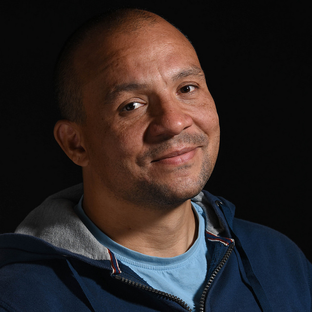

This page describes my professional interests and goals. I'm also on [Twitter](https://twitter.com/gtvjones) and [LinkedIn](https://www.linkedin.com/in/gtvjones/).

## _Why_ am I a Lead Developer?

As developers we build things countless millions of people across the world rely on. This is an amazing privilege and a huge responsibility: good work produces far-reaching positive impact and advances our organisation's goals, but; poor work can make things difficult or impossible to use and jeopardise these goals.

Fortunately, web technologies can accommodate huge differences in users' hardware, software, network, context and ability. Yet this is often overlooked in favour of development fashion and individual interest. I believe developers have a duty to use technology in ways that reflect the inherent variability of the web and serve our organisation goals.

**As a Lead Developer I have significant impact on the day-to-day decisions of many  developers and  can influence their approach as they move forward in their careers. <mark>That is a wonderful opportunity and there's nothing I'd rather do</mark>**. 

## _What_ am I interested in doing?

The things that I'm keen to do in my professional life are:

1. **Building services that produce value and which people want to use**.
2. **Making things accessible and inclusive**.
3. **Setting high standards for development** that work for users, the organisation and individual developers.
4. **Learning new skills** and seeking to **continuously improve working practices** (to be more effective at 1, 2, and 3).
5. **Helping less experienced developers** to improve their skills, shape their approach and enjoy their work.

## _How_ would I like my professional life to look

### ...in a decade?
* To be a **trusted technical leader** (at Technical Architect level or higher) with a significant track record of delivering high-quality, robust, maintainable and extensible services across a range of platforms.
* To be **highly skilled in relevant and emerging technologies of the day** with a wealth of diverse experience to ensure they are applied judiciously.
* To have been awarded a **PhD or MSc in a subject relevant to my work**. There are a number of areas that interest me, including: [advanced software engineering](https://le.ac.uk/courses/advanced-software-engineering-msc/2019), [human-computer interaction design](https://www.city.ac.uk/courses/postgraduate/human-computer-interaction-design), [big data analytics](https://edu.university-liverpool-online.com/global/programmes/computer-science/msc-in-big-data-analytics) and [machine learning](https://www.ucl.ac.uk/prospective-students/graduate/taught-degrees/machine-learning-msc).
* In addition to my day job, to be **teaching at a university or college** (part time, in the evenings).

### ...in the next two years?

I would like to:

* be a **Lead Developer**. There's a lot of potential in this role to positively influence: the productivity and morale of a development team, and; foster a culture for developers working well with other disciplines. 
* **be creatively applying my technical skills on a daily basis** by: designing, writing and reviewing code, and; **coaching and mentoring developers**.
* be working as part of an upbeat, **engaged, user-focussed, multi-disciplinary team**.
* be **building my technical leadership** skills through setting development standards and shaping the organisation's approach to development.
* have **renewed my 'full stack' development skills**. I've been focussed on front end for a few years and - while I do want to continue with this - I'm also very interested in building my 'back end' and cloud infrastructure skills.
* **be doing more things in the ‘What do I care about?' section** [(above)](#what-am-i-interested-in-doing), and none of the things described in the 'What does bad look like?' section [(below)](#what-does-bad-look-like)
* have **begun post-graduate study** in an area relevant to my work

## What does ‘bad’ look like?

So, that's all good. But I should probably mention the things I have no interest in and/or which I've identified as potentially jeopardising my professional goals.

* **Being at the mercy of negative, unhelpful and obstructive people**. I especially want to avoid being managed by someone who has little interest in improving things. I currently have an excellent line manager and it makes all the difference.
* **Being a line manager**. I did this for a few years and it was not a good match for my character strengths.
* **Slipping into a ‘generalist’ or ‘managerial’ role**. I’m always happy to help with a broad range of things (like admin and other generalist tasks), but I always intend to be a technical specialist first and foremost.